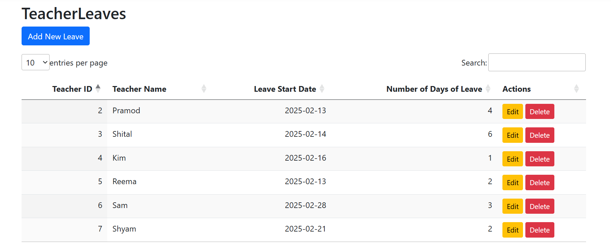

# LeaveManagementSystem_DotNetAssignment
Efficient and seamless leave management at your fingertips!
Teacher Leave Management System allows administrators to easily track and manage leave requests from teachers, ensuring transparency and streamlined approval processes. With the power to create, edit, and delete leave records, this system revolutionizes the way schools handle teacher leave applications.

This Teacher Leave Management System is designed with user experience and security in mind, featuring a comprehensive set of tools for both administrators and users. Key functionalities include:

Authentication: Secure login and registration ensure that only authorized individuals can access sensitive data.
Authorization: Role-based access control (Admin, Manager, and Staff) guarantees that users only have access to the features relevant to their role.
CRUD Operations: The system supports full Create, Read, Update, and Delete capabilities, allowing easy management of leave records.
Pagination: Manage large datasets with ease through pagination, ensuring smooth navigation and better performance.
Sorting: Sort teacher leave requests by date, number of days, or teacher name, enabling quick access to the most relevant data.
Searching: A powerful search functionality ensures you can find specific leave requests fast, whether by teacher name, leave date, or other parameters.
With these features, this system empowers school administrators to manage teacher leave efficiently while maintaining security and usability.

Firstly, this is the homepage of the web application.

